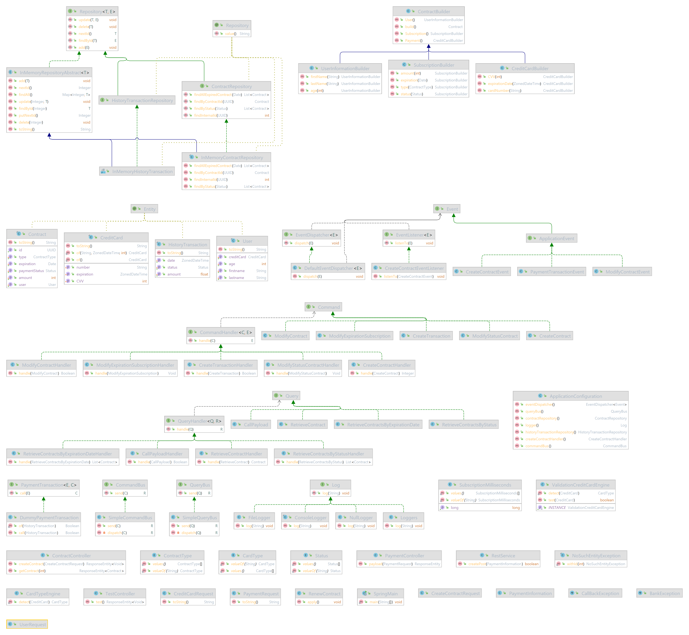

# ESGI Architecture logicielle - CC1

Par LEPROHON Cédric

Pour Monsieur Boissinot

- [Rappel](#rappel)
- [Projet](#projet)
- [Librairies](#librairies)
- [Modules](#modules)
    * [package common](#package-common)
    * [shopping](#shopping)
        + [securepay](#securepay)
- [Axe d'amélioration](#axe-d-am-lioration)

## Rappel

Conception & développement d’un module logiciel de gestion des inscriptions d’une solution e-commerce, comportant une
fonction d’ajout d’un membre.

- Respect des patterns logiciels et des concepts objets (pattern repository, injection de dépendances, programmation par
  interfaces, etc)
- Respect de ‘l’intention’ dans le code. Justifier certains critères de qualité.
- Langage: Java 11 ou +.

Pour plus d'information, consulter le fichier <u>CC1.pdf</u>

# Projet

Le projet à été produit en architecture en DDD adapté au contexte du TP.

Le projet communique avec trois module:

1. Shopping: Module principal qui permet de souscrire à deux types de contrats (CONTRACTOR, TRADESMAN)
2. Securepay: Module qui valide ou non la transaction
3. Event: architecture *messaging* permettant aux modules de communiquer.

Vous trouverez en fin de page le diagramme de classe.

# Librairies

* JUnit
* GSON

# Modules

Avant de continuer, j'ai fait un package java commun qui regroupe les classes communes utilisées par les modules.

## package common

J'utilise les annotations pour les entités et les repository afin de mieux retrouver mes entités et mes repository mais
aussi dans un soucis de nommage de classe. En effet, en utilisant les annotations, j'évite de mettre *Entity*
ou *Repository* comme suffixe.

J'utilise aussi une exception lorsque je n'arrive pas à trouver un contrat.

Également, je génère à la volée des *InMemory database* car *shopping* et *securepay* utilise des bases de données. Cela
permettra plus tard de ne pas s'embêter à recréer des *InMemory database*

Enfin, j'utilise *GSON* pour créer mon marshaller, cela permettra de diffuser des informations via l'Event Bus.
J'utilise une factory dans ma serialisation pour permettre de l'écrire plus rapidement et éviter de faire de la
redondance de code

## shopping

Pour créer un contrat, j'utilise le design pattern *Faceted builder* qui permet de séparer des informations en "
catégories"

Exemple:

```java
contractBuilder
        .User()
            .firstName("Cedric")
            .lastName("Leprohon")
            .age(27)
        .Payment()
            .cardNumber("4485678386265192")
            .CVV(1234)
            .expirationDate(ZonedDateTime.now())
        .Subscription()
            .type(ContractType.TRADESMAN)
            .amount(19)
            .status(Status.NEW)
        .build();
```

Une fois le contrat crée, l'utilisateur est redirigé vers le processus de paiement.

J'utilise ```ContratService``` qui est dépendant de ```ContratRepository``` qui est juste une façade destinée pour le
métier. J'ai préféré utiliser un repository plutôt qu'un DAO car cela correspond bien à l'architecture DDD et cela
sépare la technicité informatique à celle du métier.

J'utilise aussi des *handler* pour le traitement d'un contrat lorsque celle-ci à été traité par *securepay*. Pourquoi ce
choix ? Tout simplement pour rendre malléable le code, ainsi, si le métier change de workflow, il pourra le faire sans
aller très loin dans la technicité. (voir SubscriptionHandler.java, UpdateObjectStatusContract.java)

## securepay

Module qui autorise la transaction ou non du contrat. Il historise aussi la transaction via au repository
HistoryTransaction Un module de test à été créer pour le développement ```DummyPaymentTranasction``` qui accepte toutes
les transactions. Évidemment, elle est facilement remplaçable car elle hérite de ```PaymentTransaction``` et elle est
appelé sous la forme d'event (via à l'injection de dépendance).

# Axe d'amélioration

Conscient que ce projet est loin d'être parfait, nous pouvons parfaitement améliorer certains points:

- Mettre un peu plus d'annotation par exemple ```@Service```
- Moins de dépendance circulaire entre les différents artefacts logiciels
- Ajouter le schéma de l'``observer`` pour rendre plus qualitatif l'utilisation de l'event bus.

## Diagramme de classe

